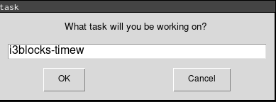
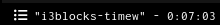

# Timew

Interact with timewarrior directly from i3blocks.


 A floating window allows to inpute the task name.



Show current task time when active.



# Config

##i3blocks

```
[timew]
command=python3 ~/.config/i3blocks/timew/timew.py
interval=10
signal=10
```

##i3

In order to have a floating window with i3.

```
# for python easygui
for_window [title="task" class="Tk"] floating enable
```
